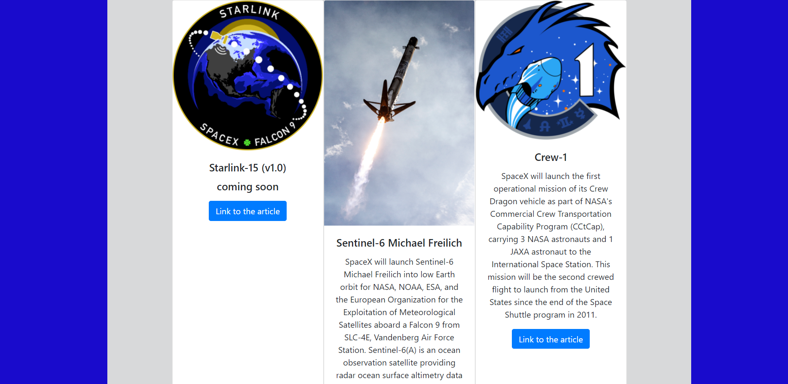

# graphi-code-exercise
builted a web page using Apollo graphyQL API to render 12 cards that shows the details and mission patch or picture of each mission with a link to the articles from spacex or a youtube video 

## Tech Used

* React.js
* react-router-dom
* Bootstrap
* Apollo-boost
* graphGL

## Screenshot

## Github repo
https://github.com/ScottLRay/graphi-code-exercise

## Deployed Site
https://naughty-cray-e37cdf.netlify.app